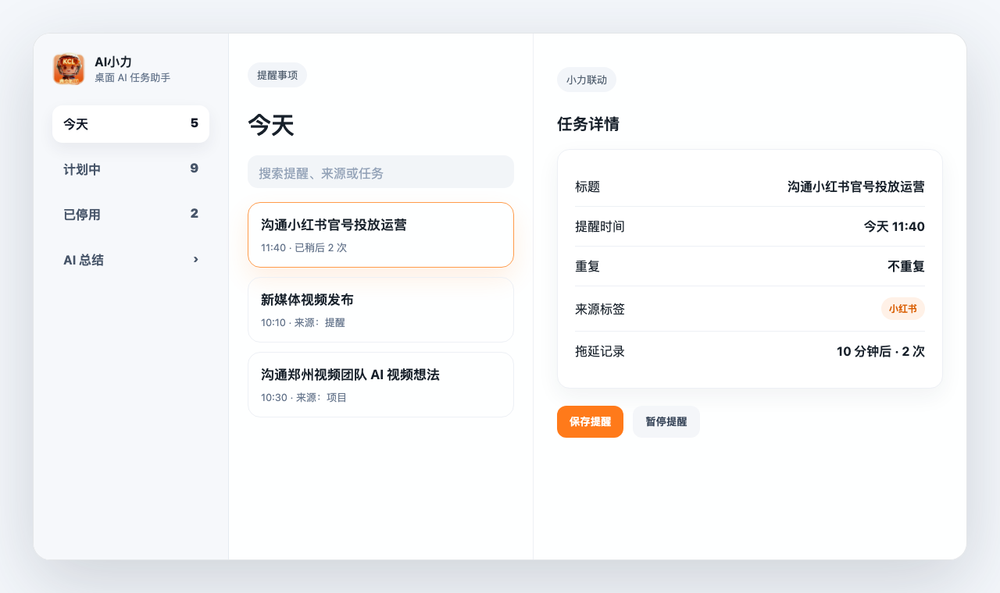
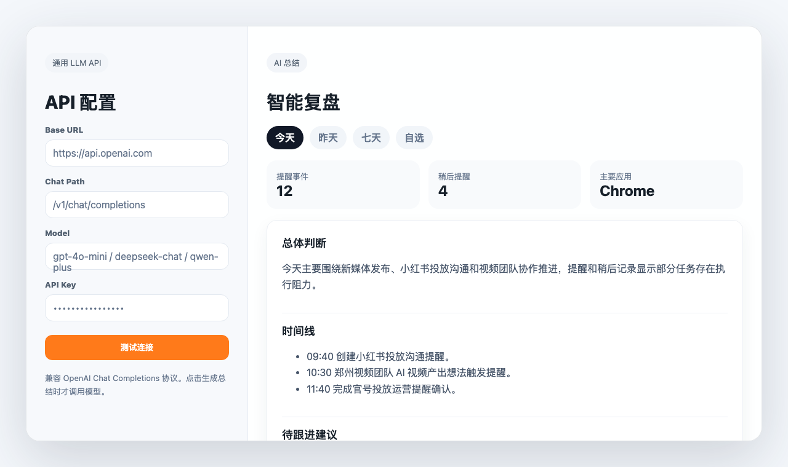

# AI小力

AI小力是一个常驻桌面的 AI 任务助手。它把桌宠、提醒、任务拖延二次提醒、活动记录和智能复盘放在同一个轻量 Electron 应用里，适合把零散提醒和一天的活动记录整理成可回看的任务上下文。macOS 版本额外支持“刚刚发生了啥”的本机语音转写。

> English summary: AI Xiaoli is a desktop AI task assistant built with Electron. It combines an animated desktop mascot, reminders, snooze tracking, local speech transcription on macOS, activity logs, and OpenAI-compatible LLM summaries.

## 功能特性

- 常驻桌面的小力形象，支持静态呼吸、提醒动画、聆听动画和对话气泡。
- 自定义提醒：一次性、每日、每周、每月重复提醒。
- 拖延任务二次提醒：“10 分钟后”会更新原提醒，并记录为复盘上下文。
- “刚刚发生了啥”：macOS 版支持主动录音、本机语音转写、草稿确认和 LLM HTML 复盘。
- AI 总结：可按今天、昨天、七天、自选时间段生成复盘，并支持自定义 Markdown 模板。
- 活动日志：可选记录前台 App 活动、提醒触发、稍后提醒和桌宠交互，用于复盘。
- macOS 顶部菜单栏入口、开机启动开关、提醒暂停、小力显示/隐藏、形象大小调节。

## 产品截图

以下截图使用演示数据，不包含真实个人提醒或复盘内容。

### 桌宠提醒

小力常驻桌面，在提醒触发时播放动效并显示对话气泡；用户可以确认提醒，也可以选择稍后提醒。


### 提醒管理

提醒面板采用接近 macOS 提醒事项的结构，支持今天、计划中、停用筛选，以及任务详情和拖延记录查看。



### AI 复盘与通用 LLM API

AI 总结支持今天、昨天、七天和自选时间段；通用 LLM API 使用 OpenAI-compatible Chat Completions 协议。



## 平台支持

| 功能 | macOS | Windows |
| --- | --- | --- |
| 桌宠提醒与动画 | 支持 | 支持 |
| 自定义提醒与稍后提醒 | 支持 | 支持 |
| 通用 LLM API 复盘 | 支持 | 支持 |
| 活动日志与历史复盘 | 支持 | 支持 |
| “刚刚发生了啥”本机语音转写 | 支持，基于 macOS Speech | 暂不支持 |
| 本仓库打包脚本 | macOS | 暂不公开 Windows 打包链路 |

## 通用 LLM API

AI小力使用 OpenAI-compatible Chat Completions 协议调用模型：

```http
POST {Base URL}{Chat Path}
Authorization: Bearer <API Key>
Content-Type: application/json
```

请求体格式：

```json
{
  "model": "your-model-name",
  "messages": [],
  "temperature": 0.2
}
```

设置页保留这些配置项：

- Base URL，例如 `https://api.openai.com`
- Chat Path，默认 `/v1/chat/completions`
- Model，例如 `gpt-4o-mini`、`deepseek-chat`、`qwen-plus`
- API Key

常见可用服务包括 OpenAI、DeepSeek、Qwen/通义千问兼容接口、Kimi/Moonshot 兼容接口、SiliconFlow、OpenRouter、OneAPI/New API、Ollama 的 OpenAI-compatible `/v1` 接口等。

暂不直接支持原生非兼容协议，例如 Anthropic 原生 Messages API、Gemini 原生 REST API。此类服务需要通过 OpenAI-compatible 网关使用，或等待后续版本适配。

## 安装使用

### 从 Release 下载

- macOS Apple Silicon：下载 `AI小力-darwin-arm64.zip`。
- Windows：下载 `AI小力-Setup-0.1.0.exe`。

macOS 当前未做 Apple notarization。如果系统提示无法打开，可在“系统设置 > 隐私与安全性”里允许打开，或自行签名/公证后再分发。

## 本地开发

当前开源源码以 macOS 技术路径为主。Windows 安装包会在 Release 中提供，但 Windows 打包链路暂不在本仓库公开。

```bash
npm install
npm run dev
```

打包 macOS：

```bash
npm run package:mac
```

## 数据位置

运行时数据写入用户目录，不写入安装目录。

macOS：

- `~/Library/Application Support/AI小力/settings.json`
- `~/Library/Application Support/AI小力/reminders.json`
- `~/Library/Application Support/AI小力/activity.jsonl`
- `~/Library/Application Support/AI小力/summary-history.json`
- `~/Library/Application Support/AI小力/just-now-history.json`

新版会从旧的 `~/Library/Application Support/AI小力桌宠/` 自动迁移提醒和设置文件。

## 隐私说明

- 第一版不读取微信、邮件或其他 App 的通知内容。
- macOS 版“刚刚发生了啥”只在用户主动点击录制时开启麦克风。
- macOS 语音转写走系统 Speech 能力；转写后才把确认文本交给用户配置的 LLM。
- API Key 保存在本机 Electron userData 中，macOS 可用时使用 `safeStorage` 加密。

## License

MIT
